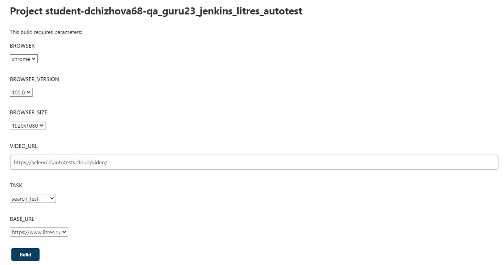
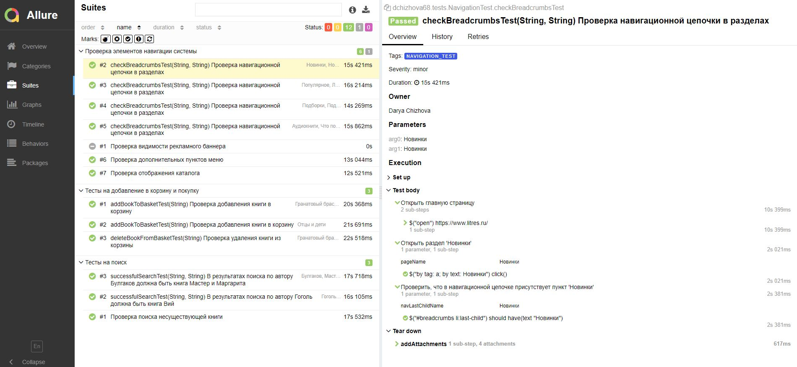
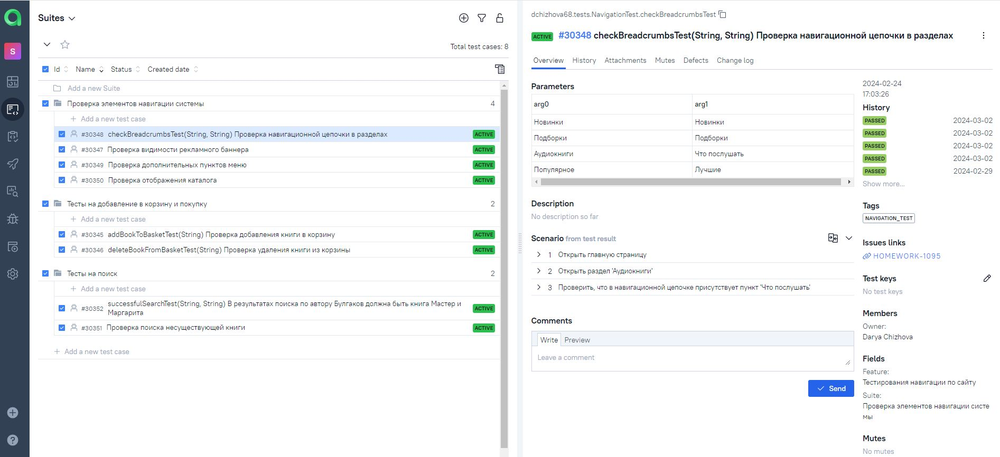
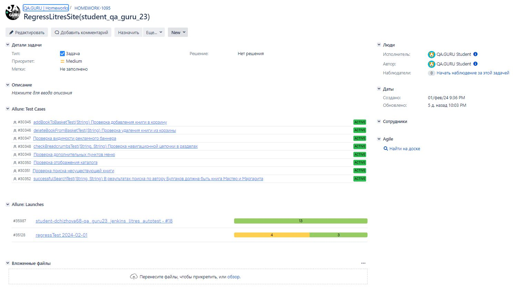
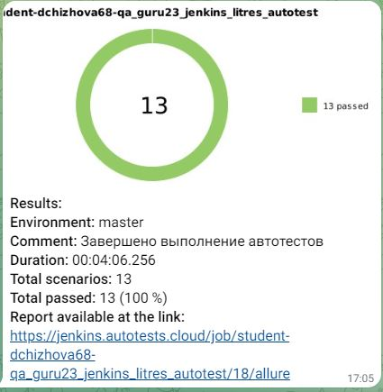

# Проект по автоматизации тестирования для сервиса электронных и аудиокниг [Литрес](https://www.litres.ru/)


## :scroll: Содержание:
* <a href="#tools">Используемый стек</a>
* <a href="#cases">Примеры автоматизированных тест-кейсов</a>
* <a href="#console">Запуск из терминала</a>
* <a href="#jenkins">Запуск тестов в Jenkins</a>
* <a href="#allure">Allure отчет</a>
* <a href="#allure-testops">Интеграция с Allure TestOps</a>
* <a href="#jira">Интеграция с Jira</a>
* <a href="#telegram">Уведомление в Telegram при помощи бота</a>
* <a href="#video">Примеры видео выполнения тестов на Selenoid</a>


<a id="tools"></a>
## :computer:<a name="Используемый стек">**Используемый стек:**</a>

<p align="center">
<a href="https://www.java.com/"></a>
<a href="https://selenide.org/"></a>
<a href="https://gradle.org/"></a>
<a href="https://junit.org/junit5/"></a>
<a href="https://github.com/"></a>
<a href="https://aerokube.com/selenoid/"></a>
<a href="https://github.com/allure-framework/allure2"></a>
<a href="https://qameta.io/"></a>
<a href="https://www.jenkins.io/"></a>
<a href="https://web.telegram.org/a/"></a>
<a href="https://www.atlassian.com/ru/software/jira/"></a>
</p>


<a id="cases"></a>
## <a name="Примеры автоматизированных тест-кейсов">**Примеры автоматизированных тест-кейсов:**</a>

- ✓ *Проверка поиска книг*
- ✓ *Проверка добавления книг и удаление книг из корзины*
- ✓ *Проверка элементов навигации по сайту*


<a id="console"></a>
## :keyboard: Запуск автотестов

***Локальный запуск тестов:***

Из корневой директории проекта выполнить:
```
gradle clean full_test -Denv=local  - запуск всех тестов локально
gradle clean buy_test -Denv=local   - запуск тестов на покупку локально
gradle clean search_test -Denv=local - запуск тестов на поиск локально
gradle clean navigation_test -Denv=local - запуск тестов на навигацию локально

```

<a id="jenkins"></a>
## </a><a name="Сборка"></a>Удаленный запуск тестов в [Jenkins](https://jenkins.autotests.cloud/job/student-dchizhova68-qa_guru23_jenkins_litres_autotest/)</a>

Для запуска сборки необходимо перейти в раздел <code>Build with parameters</code>, выбрать необходимые параметры и нажать кнопку <code>Build</code>.

###  Параметры сборки в Jenkins:
- BROWSER (браузер, по умолчанию chrome)
- BROWSER_VERSION (версия браузера, по умолчанию 100.0)
- BROWSER_SIZE (размер окна браузера, по умолчанию 1920x1080)
- REMOTE_URL (адрес удаленного сервера)
- VIDEO_URL (адрес удаленного сервера, где храниться видео с записью автотеста)
- TASK (набор тестов для запуска)
- BASE_URL (адрес основной страницы тестируемого сайта)
  
<p align="center">

</p>


<a id="allure"></a>
##  </a> Пример  [Allure-отчета](https://jenkins.autotests.cloud/job/student-dchizhova68-qa_guru23_jenkins_litres_autotest/allure/#suites/41277a3158bf1a31c2a3a799da365f5e/5360cc7af9e7f66d/) </a>  
Дождаться выполнения сборки. нажать на кнопку "Allure Report"


Пример Allure Report: 


<a id="allure-testops"></a>
##  </a> Интеграция с [Allure TestOps](https://allure.autotests.cloud/project/4014/test-cases/30348?treeId=7852) </a> 

Реализована интеграция с <code>Allure TestOps</code>. Есть возможность просмотре результата выполнения автотестов и создания ручных тестов. 

<p align="center">

</p>


<a id="jira"></a>
##  </a> Интеграция с [Jira](https://jira.autotests.cloud/browse/HOMEWORK-1095) </a> 

Реализована интеграция <code>Allure TestOps</code> с <code>Jira</code>, в задаче отображаются связные автотесты и результат их выполнения.

<p align="center">

</p>


<a id="telegram"></a>
##  Уведомления в Telegram с использованием бота

Результаты выполнения автотестов отправляются в Telegram.

<p align="center">

</p>


<a id="video"></a>
##  Видео примера запуска тестов в Selenoid

В отчетах Allure для каждого теста прикреплено видео прохождения теста
<p align="center">
  
</p>
